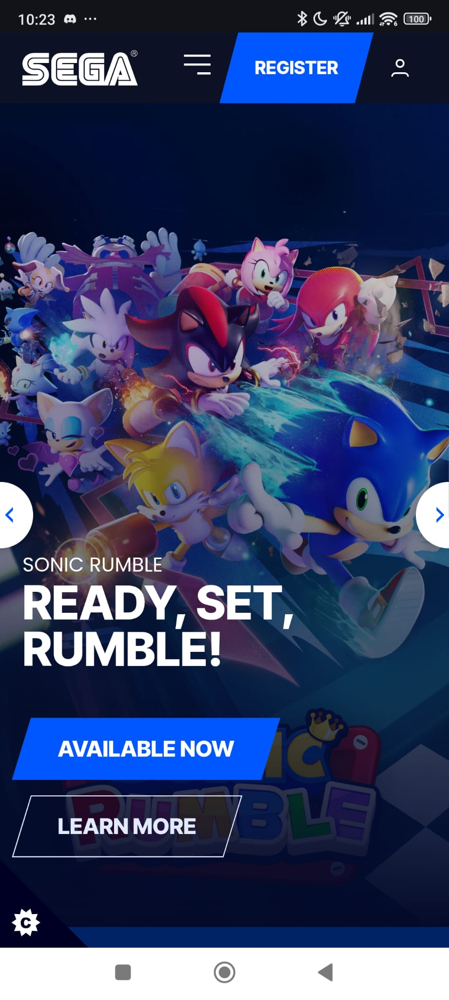
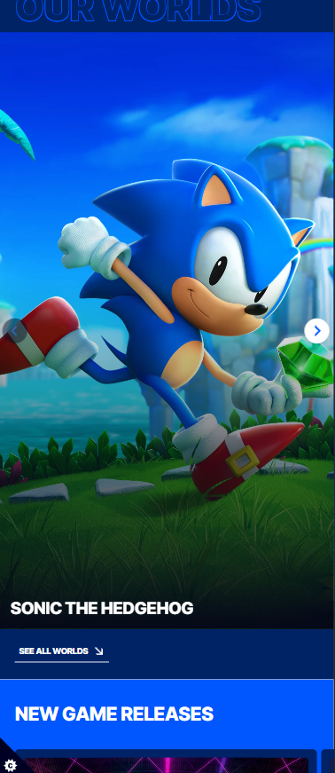
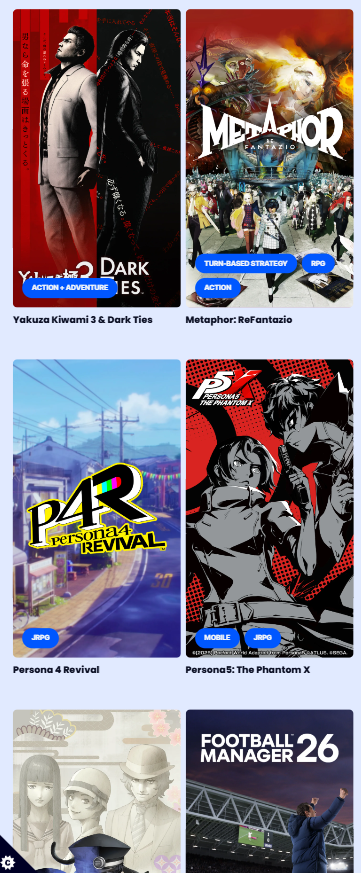
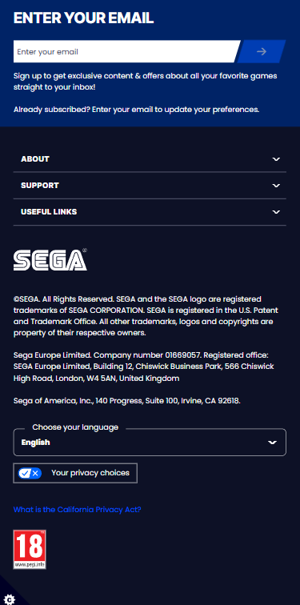
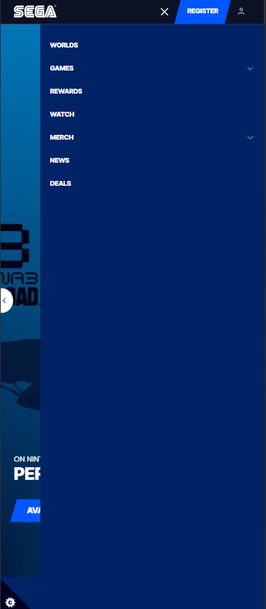

# Procesverslag
Markdown is een simpele manier om HTML te schrijven.  
Markdown cheat cheet: [Hulp bij het schrijven van Markdown](https://github.com/adam-p/markdown-here/wiki/Markdown-Cheatsheet).

Nb. De standaardstructuur en de spartaanse opmaak van de README.md zijn helemaal prima. Het gaat om de inhoud van je procesverslag. Besteedt de tijd voor pracht en praal aan je website.

Nb. Door *open* toe te voegen aan een *details* element kun je deze standaard open zetten. Fijn om dat steeds voor de relevante stuk(ken) te doen.

## Jij

  
uitwerken voor kick-off werkgroep

  ### Auteur:
  Julia Wang

  #### Je startniveau:
  Rood (denk ik, dit is middelniveau als het goed is.)

  #### Je focus:
  Mijn focus in het begin tot nu toe is de surface plane.
 

## Je website

  
uitwerken voor kick-off werkgroep

  ### Je opdracht:
  https://www.sega.com/ 

  #### Screenshot(s) van de eerste pagina (small screen): 
  Homepage Sega
  

  #### Screenshot(s) van de tweede pagina (small screen):
  Sonic Rumble 
  
 

## Toegankelijkheidstest 1/2 (week 1)

  
uitwerken na test in 2e werkgroep

  ### Bevindingen
  Screenreader Mobile Chrome:
  - Het leest alleen de cookies van de website en de informatie ervan, maar niks anders.
  
  Narrator Windows:
  - Leest eerst de cookies, dan de header en gaat dan van links naar recht, van boven naar onder.
  - Bij elke hyperlink, zegt de narrator [link] bij elk interactieve element
  - Bij elke graphic zegt het de volle naam van de afbeelding
  - Graphics die geen label hebben, worden genaamd als [unlabeled].

  WCWCAG‐checklist:
  - De kleuren zijn goed apart van elkaar zodat het goed leesbaar is.
  - De site heeft de navigatie menu
  - De H-tags en paginatitels zijn goed ondertiteld
  - De afbeelding met tekst overeen hebben een soort donkere filter zodat de tekst overheen meer leesbaar is.
  - Het is moeilijk te zien of elk afbeelding een alt-tag hebben. Bij de screenreader is het ook zo
  dat de graphic [unlabeled] is of de origineele volle naam geeft, geen alt.
  - Alles is klikbaar met de toetsenboord, behalve de hero carousel, die is niet met de toetsenbord interactief.

Bij screenreader is er veel links, en het helpt wel. Ook is het bij elk sega pagina dat ze eerst de cookies lezen.
Dit komt dat de cookies in sega.com een cookiecontrol menu gebruiken waardoor de menu permanent op elk pagina zit
en waardoor je zelf de cookies kan customizen wanner je wilt.

De vormgeving is wel fijn met de contrast van kleuren met elkaar en de brightness van afbeeldingen zodat de tekst meer leesbaar is.
Veel dingen kon ik alleen niet inspecteren doordat de er heel veel script-tags zijn bij de sega.com website. De screenreader
heeft me wel geholpen wat er misschien niet in is bijvoorbeeld alt-tags etc.\

Bijna alles is met de toetsenbord the interacteren, behalve de carousal in de hero section.

## Breakdownschets (week 1)

  
uitwerken na afloop 3e werkgroep

  ### de hele pagina: 
  
  
  
  
  
  

  ### dynamisch deel (bijv menu): 
  

  ### wellicht nog een dynamisch deel (bijv filter): 
  

## Voortgang 1 (week 2)

  
uitwerken voor 1e voortgang

  ### Stand van zaken
  hier dit ging goed & dit was lastig (neem ook screenshots op van delen van je website en code)

  ### Agenda voor meeting
  samen met je groepje opstellen

  | student 1      | student 2          | student 3    | student 4        |
  | ---            | ---                | ---          | ---              |
  | dit bespreken  | en dit             | en ik dit    | en dan ik dat    |
  | en dat ook nog | dit als er tijd is | nog een punt | dit wil ik zeker |
  | ...            | ...                | ...          | ...              |

  ### Verslag van meeting
  hier na afloop snel de uitkomsten van de meeting vastleggen

  - punt 1
  - punt 2
  - nog een punt
  - ...

## Voortgang 2 (week 3)

  
uitwerken voor 2e voortgang

  ### Stand van zaken
  hier dit ging goed & dit was lastig (neem ook screenshots op van delen van je website en code)

  ### Agenda voor meeting
  samen met je groepje opstellen

  | student 1      | student 2          | student 3    | student 4        |
  | ---            | ---                | ---          | ---              |
  | dit bespreken  | en dit             | en ik dit    | en dan ik dat    |
  | en dat ook nog | dit als er tijd is | nog een punt | dit wil ik zeker |
  | ...            | ...                | ...          | ...              |

  ### Verslag van meeting
  hier na afloop snel de uitkomsten van de meeting vastleggen

  - punt 1
  - punt 2
  - nog een punt
- ...

## Toegankelijkheidstest 2/2 (week 4)

  
uitwerken na test in 9e werkgroep

  ### Bevindingen
  Lijst met je bevindingen die in de test naar voren kwamen (geef ook aan wat er verbeterd is):

## Voortgang 3 (week 4)

  
uitwerken voor 3e voortgang

  ### Stand van zaken
  hier dit ging goed & dit was lastig (neem ook screenshots op van delen van je website en code)

  ### Agenda voor meeting
  samen met je groepje opstellen

  | student 1      | student 2          | student 3    | student 4        |
  | ---            | ---                | ---          | ---              |
  | dit bespreken  | en dit             | en ik dit    | en dan ik dat    |
  | en dat ook nog | dit als er tijd is | nog een punt | dit wil ik zeker |
  | ...            | ...                | ...          | ...              |

  ### Verslag van meeting
  hier na afloop snel de uitkomsten van de meeting vastleggen

  - punt 1
  - punt 2
  - nog een punt
  - ...

## Eindgesprek (week 5)

  
uitwerken voor eindgesprek

  ### Je uitkomst - karakteristiek screenshots:
  

  ### Dit ging goed/Heb ik geleerd: 
  Korte omschrijving met plaatjes

  

  ### Dit was lastig/Is niet gelukt:
  Korte omschrijving met plaatjes

  

## Bronnenlijst

  
continu bijhouden terwijl je werkt

  Nb. Wees specifiek ('css-tricks' als bron is bijv. niet specifiek genoeg). 
  Nb. ChatGpT en andere AI horen er ook bij.
  Nb. Vermeld de bronnen ook in je code.

  1. bron 1
  2. bron 2
  3. ...

